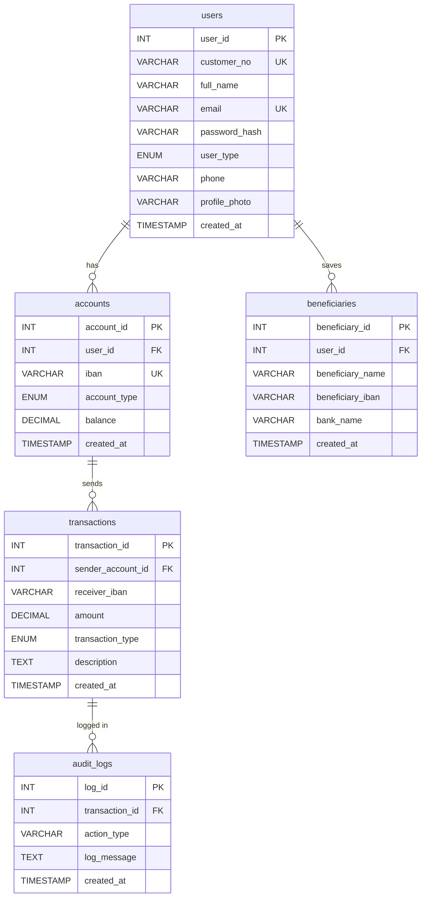

# BankingApp — Web-Based Internet Banking System

A full-stack internet banking application built with PHP, MySQL, and Bootstrap as a graduation project for the Computer Engineering Department at Çukurova University.

---

## Table of Contents

- [Overview](#overview)
- [Features](#features)
- [Tech Stack](#tech-stack)
- [Project Structure](#project-structure)
- [Database Design](#database-design)
- [Security](#security)
- [Setup & Installation](#setup--installation)
- [Usage](#usage)
- [Form Elements](#form-elements)

---

## Overview

BankingApp provides a secure, responsive web interface for managing bank accounts, performing money transfers, and tracking transaction history. The system is built on a three-tier architecture — a Bootstrap-powered frontend, a PHP application layer, and a MySQL database with stored procedures, triggers, and JOIN-based views.

---

## Features

- User registration with auto-generated customer number and user type selection (Personal / Business)
- Secure login via customer number or email, with PERSONAL / BUSINESS tab switching
- Dashboard with account summary, total balance, and recent transactions
- Account creation with account type selection (Current / Savings)
- Money transfers via stored procedure — atomic, with internal/external classification
- Automatic audit logging via database trigger on every transfer
- Transaction history via a 3-table JOIN view
- Beneficiary management — add, save during transfer, and delete
- Profile update with file upload (profile photo) and multiple notification preference selection
- Forgot password flow
- Session-based authentication with auth guard on all protected pages
- Fully responsive layout using Bootstrap 5

---

## Tech Stack

| Layer | Technology |
|---|---|
| Frontend | HTML5, CSS3, Bootstrap 5, JavaScript |
| Backend | PHP 8 (procedural, action-handler pattern) |
| Database | MySQL 8 via MySQLi prepared statements |
| Server | Apache HTTP Server (XAMPP) |
| Validation | Custom regex-based validator library (`lib/validators.php`) |

---

## Project Structure

```
bankingapp/
├── actions/
│   ├── account_create_action.php
│   ├── beneficiary_add_action.php
│   ├── beneficiary_delete_action.php
│   ├── login_action.php
│   ├── profile_update_action.php
│   ├── register_action.php
│   └── transfer_action.php
├── assets/
│   ├── css/
│   │   └── style.css
│   ├── js/
│   │   └── app.js
│   └── uploads/
├── config/
│   └── db.php
├── includes/
│   ├── auth_guard.php
│   ├── dashboard_footer.php
│   ├── dashboard_header.php
│   ├── footer.php
│   ├── header.php
│   └── navbar.php
├── lib/
│   └── validators.php
├── sql/
│   ├── schema.sql
├── accounts.php
├── beneficiaries.php
├── dashboard.php
├── forgot_password.php
├── index.php
├── login.php
├── logout.php
├── profile.php
├── register.php
├── transactions.php
└── transfer.php
```

---

## Database Design

### Tables

The schema is normalized to **Third Normal Form (3NF)**. Every non-key attribute depends solely on its table's primary key, with no repeating groups or transitive dependencies.

| Table | Description |
|---|---|
| `users` | Registered users with customer number, user type, and hashed password |
| `accounts` | Bank accounts linked to users via `user_id` FK |
| `beneficiaries` | Saved recipient IBANs linked to users via `user_id` FK |
| `transactions` | Transfer records linked to sender account via `sender_account_id` FK |
| `audit_logs` | Automatic log entries linked to transactions via `transaction_id` FK |

### Relationships

```
users  ──< accounts       (user_id, 1:N, ON DELETE CASCADE)
users  ──< beneficiaries  (user_id, 1:N, ON DELETE CASCADE)
accounts ──< transactions (account_id → sender_account_id, 1:N)
transactions ──< audit_logs (transaction_id, 1:1, ON DELETE SET NULL)
```

### Stored Procedure

`transfer_money(sender_account_id, receiver_iban, amount, description)` — executes the full transfer atomically inside a transaction block:

1. Locks sender balance with `FOR UPDATE`
2. Validates balance and amount
3. Deducts from sender
4. Credits receiver if IBAN exists internally (sets `transaction_type = 'internal'`), otherwise records as `'external'`
5. Commits or rolls back on error via `SIGNAL SQLSTATE '45000'`

### Trigger

`after_transaction_insert` — fires `AFTER INSERT ON transactions` and automatically writes a row to `audit_logs` with the transfer amount, sender account ID, and receiver IBAN. Requires no application-level code.

### JOIN View

`transaction_history_view` — joins `transactions`, `accounts`, and `users` to expose sender IBAN and user details alongside each transaction record. Used by `transactions.php`.

```sql
SELECT t.transaction_id, u.user_id, u.full_name,
       a.iban AS sender_iban, t.receiver_iban,
       t.amount, t.transaction_type, t.description, t.created_at
FROM transactions t
JOIN accounts a ON t.sender_account_id = a.account_id
JOIN users u    ON a.user_id = u.user_id;
```

---

## Security

### SQL Injection
Every database query uses `$conn->prepare()` with `bind_param()`. User input is never concatenated into a query string.

### XSS (Cross-Site Scripting)
All values rendered in HTML pass through `htmlspecialchars()` before output, converting `<`, `>`, `"` and `&` into their safe HTML entity equivalents.

### Password Storage
Passwords are hashed with `password_hash($password, PASSWORD_DEFAULT)` (bcrypt). Login uses `password_verify()` — plain text is never stored or compared directly.

### File Upload Security
Profile photo uploads are validated in three layers:
1. File extension allowlist (`jpg`, `jpeg`, `png`, `webp`)
2. `mime_content_type()` check on the actual file content
3. 2MB size limit

Uploaded files are saved with a randomly generated filename (`uniqid("profile_", true)`) to prevent enumeration.

### Session Security
- Auth guard (`includes/auth_guard.php`) on every protected page
- `session_regenerate_id(true)` on login to prevent session fixation
- Remember Me extends cookie lifetime to 30 days via `session_set_cookie_params()`

### Input Validation — `lib/validators.php`

| Function | Rule |
|---|---|
| `validateFullName()` | Letters and spaces only, 2–100 characters, Turkish char support |
| `validateEmail()` | Standard format with domain and extension |
| `validatePassword()` | Min 6 characters, at least one letter and one digit |
| `validatePhone()` | Digits only, optional `+` prefix, 10–20 characters |
| `validateIBAN()` | `TR` prefix followed by exactly 24 digits |
| `validateAmount()` | Positive number, max 2 decimal places |
| `validateDescription()` | Max 255 characters, alphanumeric + basic punctuation |
| `cleanIBAN()` | Strips spaces, uppercases, prepends `TR` if missing |

---

## Setup & Installation

### Prerequisites

- XAMPP (Apache + MySQL + PHP 8)
- A web browser

### Steps

1. Clone or copy the project into your XAMPP `htdocs` directory:
   ```
   /Applications/XAMPP/xamppfiles/htdocs/bankingapp/
   ```

2. Start Apache and MySQL from the XAMPP Control Panel.

3. Open phpMyAdmin at `http://localhost/phpmyadmin`.

4. Import `sql/schema.sql` — this creates the `banking_app` database, all tables, the stored procedure, the trigger, and the JOIN view.

5. Open `config/db.php` and confirm the database name matches:
   ```php
   $dbname = "banking_app";
   ```

6. Ensure `assets/uploads/` is writable:
   ```bash
   chmod 755 /Applications/XAMPP/xamppfiles/htdocs/bankingapp/assets/uploads
   ```

7. Open `http://localhost/bankingapp` in your browser.

---

## Usage

1. **Register** at `/register.php` — choose Personal or Business, enter your details. Your customer number is displayed on the login page after registration.

2. **Login** at `/login.php` — select the correct tab (PERSONAL / BUSINESS), enter your customer number or email and password.

3. **Create an account** at `/accounts.php` — select Current or Savings. An IBAN is generated automatically.

4. **Transfer money** at `/transfer.php` — select a sender account, enter the receiver IBAN (24 digits after TR), amount, and optional description. Optionally save the receiver as a beneficiary.

5. **View transactions** at `/transactions.php` — full transfer history with sender IBAN, receiver IBAN, amount, type, and date.

6. **Manage beneficiaries** at `/beneficiaries.php` — add and delete saved recipients.

7. **Update profile** at `/profile.php` — change your name, upload a profile photo, and set notification preferences.

---

## Form Elements

The application uses all seven web form element types required by the project specification:

| Element | Location |
|---|---|
| Text field | Registration, login, transfer, beneficiary forms |
| Textarea | Transfer description field |
| Checkbox | Transfer — "Save as beneficiary"; Login — "Remember Me" |
| Radio button | Registration — user type (Personal / Business) |
| Drop-down list | Transfer — sender account; Accounts — account type |
| Multiple select | Profile — notification preferences |
| File button | Profile — profile photo upload |

---

## Entity-Relationship Diagram



---

## Project Timeline

The project was planned as a 12-week development process, starting from requirement analysis and ending with documentation and presentation preparation.


